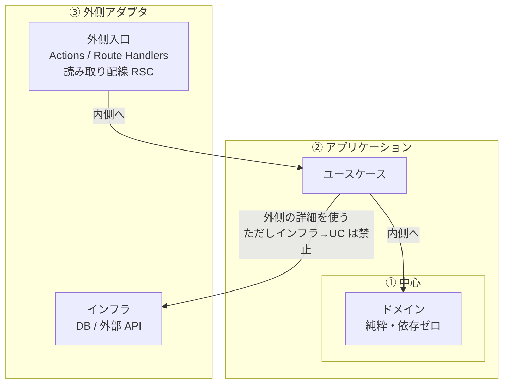

---
paths:
  - "**/next.config.*"
  - "**/app/**/route.ts"
  - "**/app/**/route.tsx"
  - "**/app/**/actions.ts"
  - "**/app/**/actions.tsx"
  - "**/actions/**/*.ts"
  - "**/actions/**/*.tsx"
  - "**/domain/**"
  - "**/infrastructure/**"
  - "**/use-cases/**"
  - "**/usecases/**"
---

# ⚙️ Next.js / backend — 責務分離（サーバ側の上乗せ）

> **適用範囲: Next.js（App Router）のサーバ側処理。** Next.js でなければ本書は適用外として読み捨てること。
>
> **共通則は [common/coding.md](../common/coding.md)**（整形はツール／型を弱めて緑にしない／
> 名前付き export・barrel 禁止・パスエイリアス／`NEXT_PUBLIC_` の秘密）。
> テストの書き方は [testing.md](./testing.md)（共通の配線は [common/testing.md](../common/testing.md)）。
> 本書は**それに従ったうえで**、サーバ側のロジックをどこに書くかだけを定める。共通側の再掲はしない。
>
> **ディレクトリ名は harness では固定しない。** 住所はプロジェクトの `CLAUDE.md` に記録する。
> **固定するのは役割の分離そのもの**である。`paths` に出る `domain/` 等は発見用の手がかりであり、必須のフォルダ名ではない。

---

## 0. 到達点の定義（混ぜると失われるもの）

App Router では Server Component も Server Actions もサーバで走る。
そのため **UI の隣に DB アクセスや判定を書いてしまい、動きはする**。

壊れるのは「動くこと」ではなく、次が同時に失われることである。

- ドメイン判定を単体で試せない（DB や `next/*` が足枷になる）
- 同じ判定が Action・page・Route Handler にコピーされる
- キャッシュ無効化や redirect が業務ロジックに食い込み、置き換え不能になる

**本書の役目は、1 つの関数に責務を混ぜる（ファット・アクション化する）抜け道を塞ぐことにある。**

---

## 1. 役割は 4 つ。住所は問わない

| 役割 | 責務 | 含めてはいけないもの |
| --- | --- | --- |
| **ドメイン** | ビジネスルール、判定、計算 | DB／HTTP／時計／乱数などの副作用。`next/*` |
| **インフラ** | DB アクセス、外部 API、メール送信など副作用 | 複雑な業務判定・分岐（ドメイン知識） |
| **ユースケース** | シナリオのオーケストレーション（取得→判定→保存の組み立て） | `revalidatePath` / `redirect` / `cookies` / `headers` など Next 固有 API |
| **外側入口** | 信頼できない入力の検証、ユースケース呼び出し、Next／HTTP 固有の入出力 | DB 操作やドメイン判定の本体 |

**外側入口**は実装形が 2 つある（どちらもオニオンの外側の環。役割名は同じ「入口」）:

| 実装形 | いつ使うか | 呼び手向けの成功／失敗の運び方（詳細 §6） |
| --- | --- | --- |
| **ミューテーション・コントローラー — Server Actions** | 同じアプリ内でサーバ上の真実を変える | **呼び手向け Result**。例外の生スタックを晒さない |
| **ミューテーション・コントローラー — Route Handlers** | 外部向け HTTP | **HTTP status ＋ body**（同じ Result 形を JSON で返してもよい） |
| **読み取り配線**（`page.tsx` / `layout.tsx` の RSC） | 初期表示などの読み取り | **`notFound()` / error UI / ビュー props への写像**。Client 向け Result 型は必須にしない |

**ディレクトリ例**（拘束力は無い）:

`domain/` · `infrastructure/` · `use-cases/` · `app/actions/`（や Route Handlers）· `app/**/page.tsx`（読み取り配線）

**1 つの関数・モジュールに上表の役割を混ぜない。**

### 1.1 実装の所有者（誰が何を書くか）

| 成果物 | 書く実装体 |
| --- | --- |
| **ドメイン／ユースケース／インフラの本体** | **backend-logic** |
| Server Actions / Route Handlers の**本体**（検証・ユースケース呼び出し・`revalidatePath` 等） | **backend-logic** |
| `page` / `layout` の**読み取り配線**（params 検証・**既存**ユースケースの呼び出し・ビューへの props 渡し） | **frontend-logic** |
| presentational な見た目 | **frontend-ui** |
| `middleware.ts`（薄い縁のみ。[common/coding.md](../common/coding.md) §4） | **backend-logic**（別にするならプロジェクト `CLAUDE.md` に宣言） |

frontend はユースケースや Actions を**呼び・props で渡す**だけにし、本体を新設・肥大させない。
読み取りに必要なユースケースが未だ無いときは **backend-logic 側で先に用意する**（FE が infra 直呼びやユースケース新設に逃げない）。
backend は page の JSX を作らない。

---

## 2. 依存関係（オニオン：依存は内向きだけ）

層は玉ねぎのように同心円で持つ。**ソースの参照（import）は常に内側へだけ向ける。**

```text
┌──────────────────────────────────────────────────────────────┐
│ ③ 外側アダプタ（フレームワーク・I/O が見える）                 │
│                                                              │
│   外側入口                          インフラ                   │
│   ・ミューテーション・コントローラー   DB / 外部 API             │
│     （Actions / Route Handlers）                              │
│   ・読み取り配線（RSC page/layout）                           │
│        │                              ▲                      │
│        │ 呼ぶ                         │ 使う（詳細）           │
│        ▼                              │                      │
│   ┌───────────────────────────────────┴────────────────────┐ │
│   │ ② アプリケーション — ユースケース                        │ │
│   │    シナリオの組み立て（読む→判定→書く）                   │ │
│   │                      │                                 │ │
│   │                      ▼ 判定を頼む                        │ │
│   │         ┌────────────────────────────┐                 │ │
│   │         │ ① 中心 — ドメイン           │                 │ │
│   │         │ 純粋な業務ルール・計算       │                 │ │
│   │         │ （外側を一切知らない）       │                 │ │
│   │         └────────────────────────────┘                 │ │
│   └────────────────────────────────────────────────────────┘ │
└──────────────────────────────────────────────────────────────┘
```



| 環 | 層 | 向いてよい参照 | 禁止 |
| --- | --- | --- | --- |
| ① 中心 | **ドメイン** | なし（純粋処理のみ） | インフラ・ユースケース・外側入口・`next/*` |
| ② | **ユースケース** | ドメイン（必須）。インフラは組み立てのために使ってよい | 外側入口／`revalidatePath` 等の Next API |
| ③ 外側 | **外側入口** | ユースケース（＋縁のスキーマ検証） | インフラやドメイン本体の直書き。入口どうしで業務を完結させない |
| ③ 外側 | **インフラ** | DB／HTTP クライアント等 | ユースケース・外側入口。業務判定 |

要点:

- **外側入口とインフラは同じ外側の環**に並ぶ。互いに直接つないで業務を済ませない（必ずユースケースを経由する）
- **ドメインは中心**で、誰にも依存しない
- **ユースケースは中心を守りながら外側を使う**層

実行時（ミューテーション）: ミューテーション・コントローラー → ユースケース →（インフラで読む → ドメインで判定 → インフラで書く）→ 呼び手への成功／失敗の明示（Actions なら Result、RH なら status＋body）／必要なら `revalidatePath` 等。
実行時（読み取り）: 読み取り配線 → ユースケース → ビューへ props（§3）。

---

## 3. 入口の選び方

| 目的 | 外側入口の実装形 |
| --- | --- |
| **同じアプリ内のミューテーション** | **Server Actions**（ミューテーション・コントローラー）を既定 |
| **外部公開 HTTP** | **Route Handlers**（`route.ts`） |
| **読み取り**（一覧・詳細の初期表示など） | **読み取り配線**（RSC）。UI の薄さは [frontend/coding.md](../frontend/coding.md)。読み取り専用に Server Actions を増やさない |

いずれも外側入口であり、**インフラやドメインを入口に直書きしない。**

---

## 4. ユースケースの流れ

ユースケースが書いてよいのは、おおよそ次の組み立てだけである。

1. インフラで読む
2. ドメインで判定・計算する
3. 必要ならインフラで書く

ユースケースは**シナリオ結果**（成功データまたは理由コード）を返す。
フィールド名はプロジェクトで揃える。ミューテーション・コントローラーがそれを**呼び手向けの形**（§6: Actions なら Result、RH なら status＋body）へ写像する。

```ts
//  OK: オーケストレーションだけ（シナリオ結果の例。形はプロジェクトで統一）
export async function renameUser(input: { id: string; name: string }, deps: Deps) {
  const current = await deps.users.findById(input.id);
  if (current === null) return { ok: false as const, reason: "not_found" as const };
  const decided = decideDisplayName(current, input.name); // ドメイン（純粋）
  if (!decided.ok) return decided;
  await deps.users.save(decided.user);
  return { ok: true as const, user: decided.user };
}
```

```ts
//  NG: ユースケースが Next に依存する
import { revalidatePath } from "next/cache";
//  NG: ユースケースに SQL／業務の長い分岐が同居する
```

`revalidatePath` / `redirect` / cookie 操作は **ミューテーション・コントローラー**に置く。

---

## 5. 信頼境界での実行時検証（zod）

TypeScript の型はコンパイル時だけの約束である。
**外から入る値**は、外側入口の縁で **zod 等による実行時スキーマ検証**を行い、通ったものだけをユースケースへ渡す。

| 入口 | 検証する対象の例 |
| --- | --- |
| ミューテーション・コントローラー | Server Actions の引数、Route Handlers の body／query |
| 読み取り配線 | `params` / `searchParams`（必要なもの） |

- **縁で一度検証すれば足りる。** ユースケース入口やドメインで「もう一度 zod」は求めない
- 業務の不変条件はドメインの責務であり、スキーマ検証の代わりにしない
- ライブラリは既定を zod とする。別ライブラリにするプロジェクトは `CLAUDE.md` に宣言する

```ts
//  ミューテーション・コントローラー（Server Action）側のイメージ
const parsed = CreateUserSchema.safeParse(raw);
if (!parsed.success) {
  return { success: false as const, error: "入力が不正です" };
}
const outcome = await createUser(parsed.data, deps);
if (!outcome.ok) {
  return { success: false as const, error: toUserMessage(outcome.reason) };
}
revalidatePath("/users");
return { success: true as const, data: outcome.user };
```

読み取り配線での検証イメージは [frontend/coding.md](../frontend/coding.md) §2。

---

## 6. 失敗の運び方（入口の実装形で分ける）

### ミューテーション・コントローラー（Server Actions と Route Handlers）

どちらも同じ外側入口の役割である。例外を投げっぱなしにして呼び手へ生スタックを晒さない。
**成功と失敗が呼び手から判別できること**を必須とする。運び方はプロジェクトで **1 系統**に揃える。

| 実装形 | 判別の例（固定ではない） |
| --- | --- |
| Server Actions | 共有の呼び手向け Result（下例） |
| Route Handlers | HTTP status ＋ body（同じ Result 形を JSON で返してもよい） |

```ts
//  Server Actions 向けの例（固定ではない）
type ActionResult<T> =
  | { success: true; data: T }
  | { success: false; error: string };
```

ユースケースのシナリオ結果（§4 の `ok` / `reason` 等）と呼び手向けの形は**別物でもよい**。
ミューテーション・コントローラーが縁で写像する。デモや実装でフィールド名を混ぜない。

### 読み取り配線（RSC）

Client に返す ActionResult 型は必須にしない。代わりに次のいずれかで明示する。

- 不正な `params` → `notFound()` など到達可能な UI
- 取得失敗 → `error.tsx` に任せる／ビュー props で error／empty を渡す（[frontend/components.md](../frontend/components.md)）

---

## ✅ 返す前チェックリスト

- [ ] 依存の矢印が逆流していないか
- [ ] ドメインが副作用も `next/*` も持っていないか
- [ ] インフラに業務の条件分岐が沈んでいないか
- [ ] ユースケースが `revalidatePath` / `redirect` / `cookies` 等を import していないか
- [ ] 外側入口以外からインフラを直呼びしていないか
- [ ] Actions / Route Handlers の本体を frontend 側で肥大させていないか（§1.1）
- [ ] ミューテーションの第一入口が Server Actions（外部 HTTP なら Route Handlers）か
- [ ] 外から入る値を縁でスキーマ検証してからユースケースに渡しているか
- [ ] ミューテーションで呼び手から成功／失敗が判別できるか（Actions＝Result、RH＝status＋body。読み取りは §6 の RSC 向け扱い）
